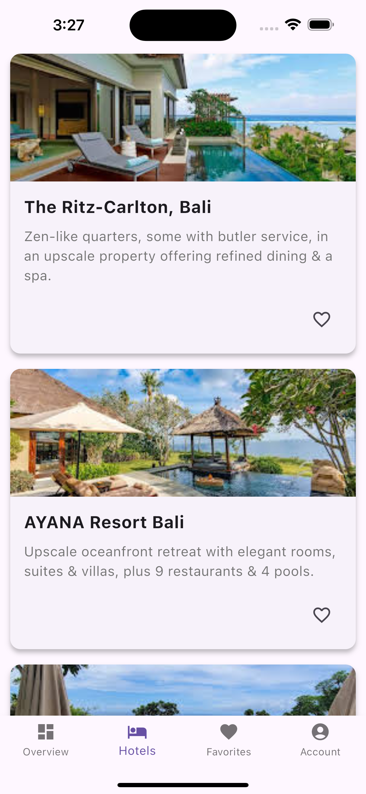

# Hotel Booking App Test

## Overview

This is a simple Flutter app for hotel bookings, built to demonstrate knowledge of Flutter, state management, error handling, and app architecture. The app includes basic functionalities such as hotel listing, saving favorites, and error handling, with a focus on a clean and intuitive UI/UX design.

## Features

### Bottom Navigation Bar
The app includes a bottom navigation bar with the following four tabs:
- **Overview**: Displays a simple text.
- **Hotels**: Fetches and displays a list of hotels from a public API (serpapi).
- **Favorites**: Displays a list of favorited hotels stored locally.
- **Account**: Displays a simple text.

### Hotels Tab
- **API Integration**: Fetches a list of hotels using the [Hotel List API](https://serpapi.com/playground?engine=google_hotels&q=Bali+Resorts&gl=us&hl=en&currency=USD&check_in_date=2024-11-24&check_out_date=2024-11-25).
- **Hotel Cards**: Each hotel card displays:
  - Image
  - Title
  - Description
  - A heart icon to mark the hotel as a favorite
- **Loading and Error Handling**: A loading spinner is shown while fetching data, and a friendly error message is displayed if the API call fails.

### Favorites Tab
- Users can mark hotels as favorites by tapping the heart icon on hotel cards.
- The favorites list is stored locally (using Hive or SharedPreferences) and displayed in the Favorites tab.
- Users can remove a hotel from their favorites by tapping the heart icon again.

### Error Handling
- Friendly error messages with a retry button are shown when the API call fails.

## Technical Requirements

### State Management
- **Bloc** library is used for state management to handle the business logic and app states (loading, success, error).
- Follows **CLEAN architecture** principles for separation of concerns.

### Navigation
- **Auto Route** package is used for navigation between screens and tab-based navigation.

### Local Storage
- **SharedPreferences** is used to store and retrieve favorite hotels.

### Testing
- Unit tests are written for business logic to ensure reliability and correctness, especially for the hotelbloc.

## Setup & Installation

To set up and run the app locally:

### Prerequisites
- Install [Flutter](https://flutter.dev/docs/get-started/install).
- Install [Dart](https://dart.dev/get-dart).

### Clone the Repository

```bash
git clone https://github.com/victorhez/hotel_booking_tes.git
cd hotel-booking-app
```

### Install Dependencies

Run the following command to fetch the required dependencies:

```bash
flutter pub get
```

### Run the App

To run the app on an emulator or connected device:

```bash
flutter run
```

## App Architecture

The app follows a **CLEAN architecture** to ensure maintainability and scalability. It separates the business logic, data management, and UI code into distinct layers:
- **Presentation Layer**: Contains UI components and manages user interactions.
- **Business Logic Layer**: Managed using the Bloc pattern, responsible for managing state and handling API requests.
- **Data Layer**: Responsible for fetching data from the API and storing favorites locally.

### Key Design Decisions
- **Bloc**: Used to handle app states (loading, success, error) and separate business logic from the UI.
- **SharedPreference**: Used for local storage of favorite hotels due to its simplicity and performance.
- **Auto Route**: Chosen for navigation to simplify routing and manage tabs.

## Screenshots & Demo Video

### Screenshot



### Demo Video
[Intro Video](intro.mp4)

## License

This project is licensed under the MIT License - see the [LICENSE](LICENSE) file for details.
